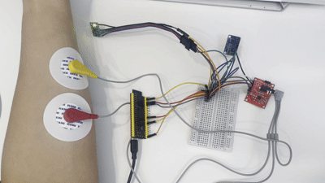
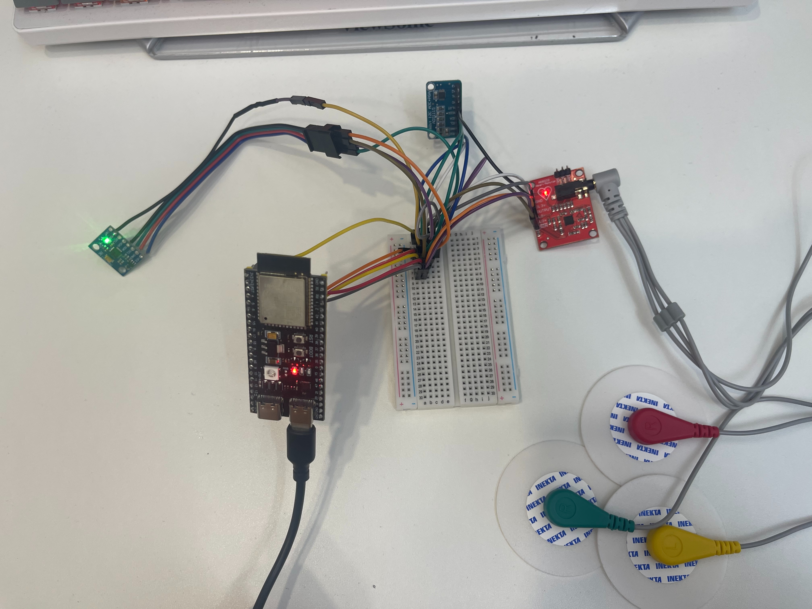
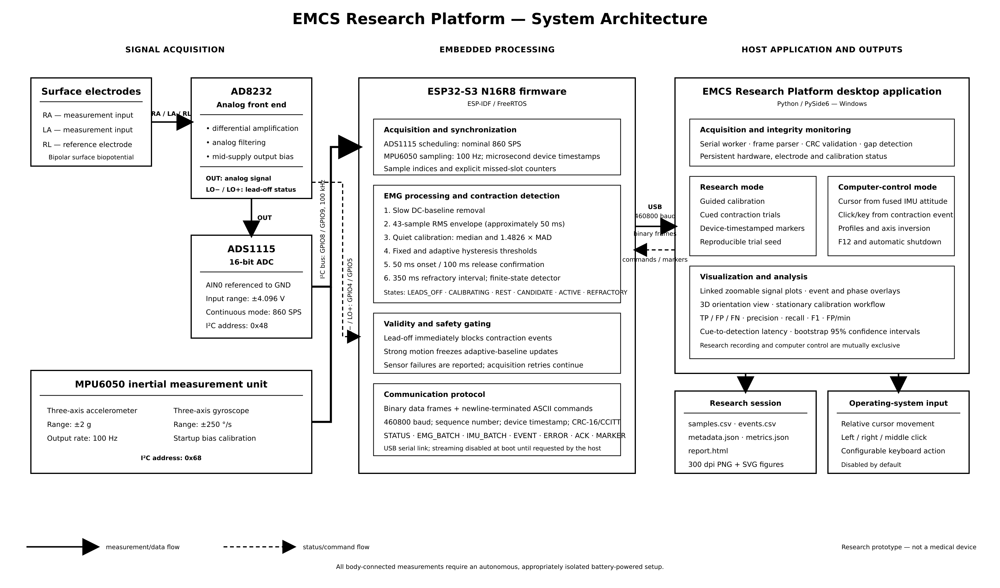
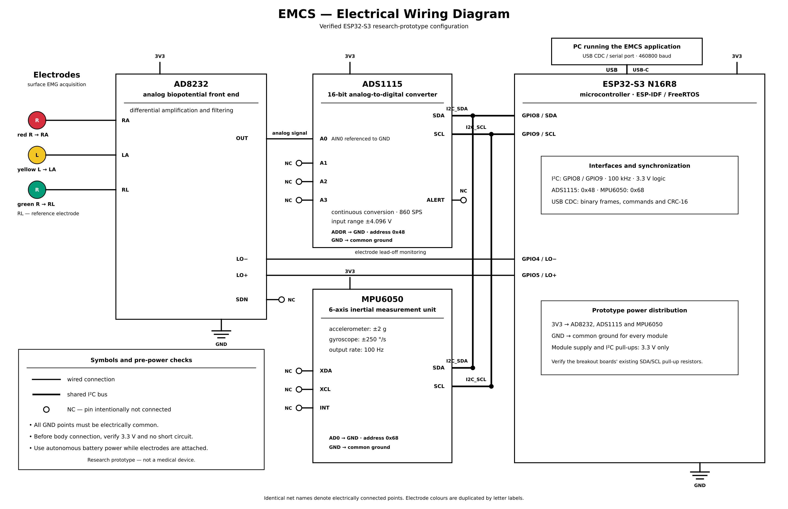
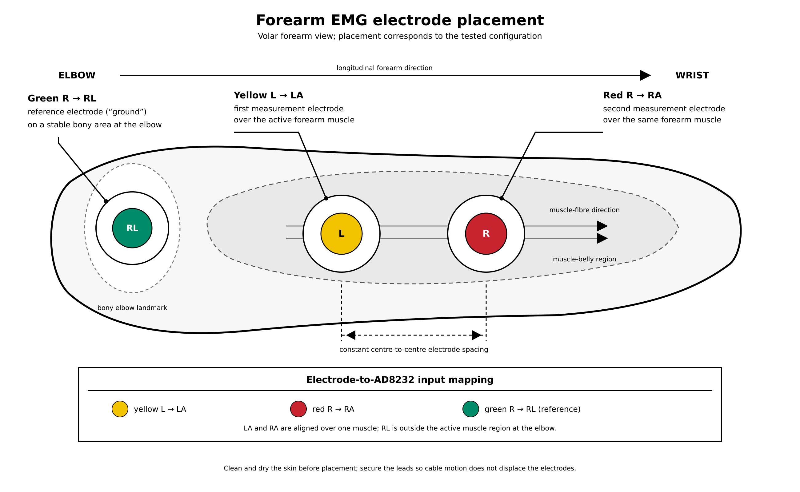
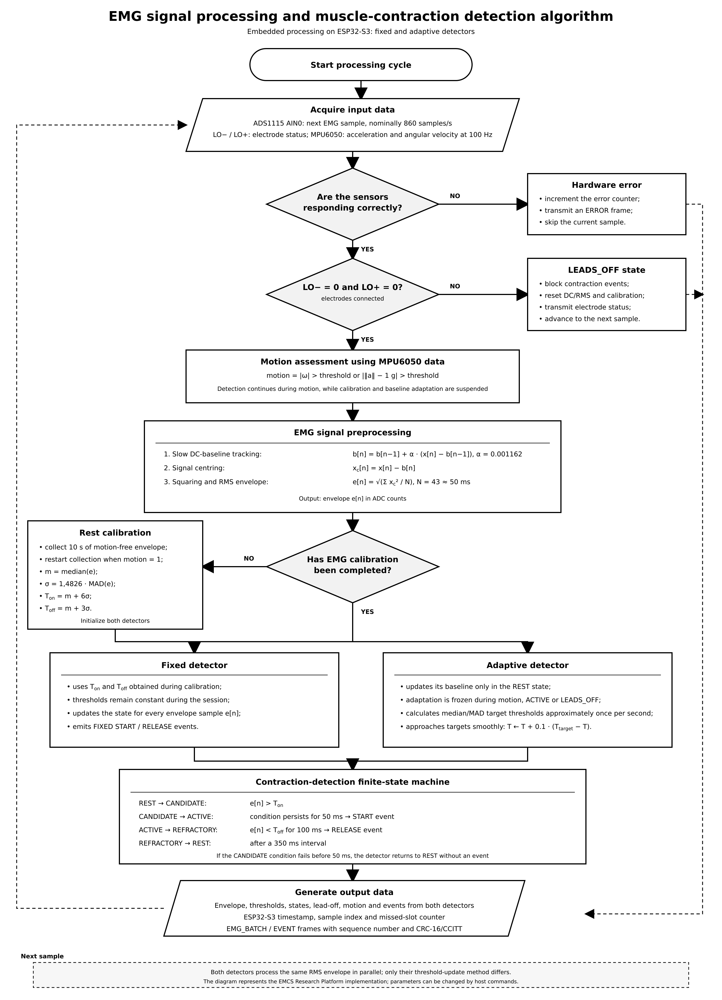
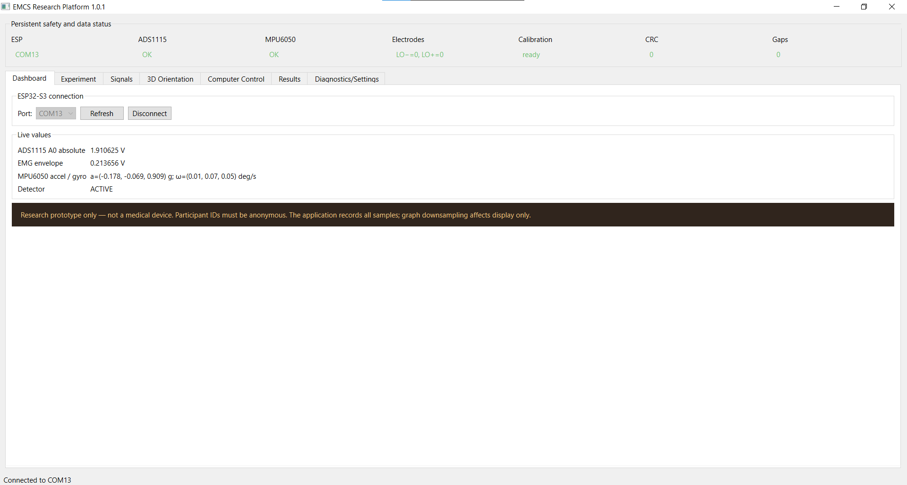
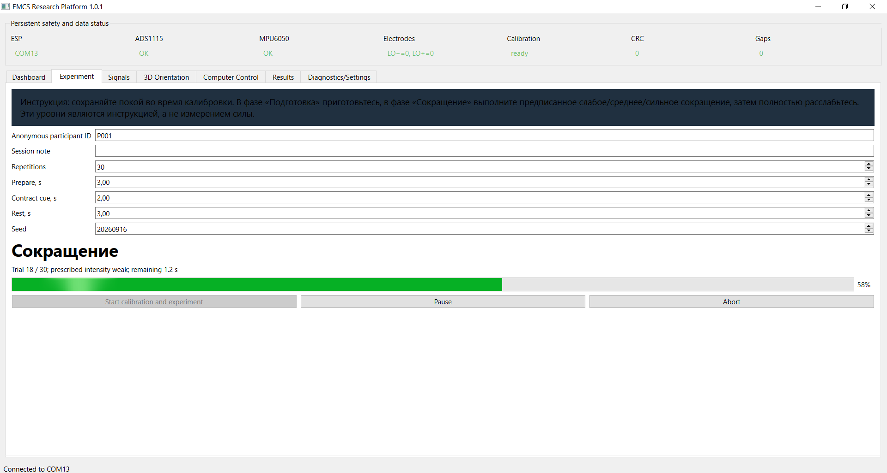
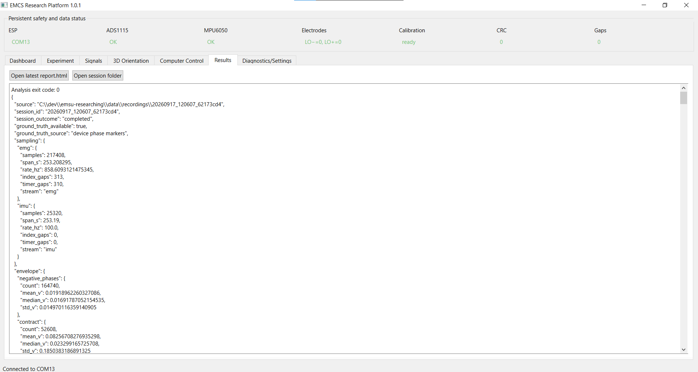
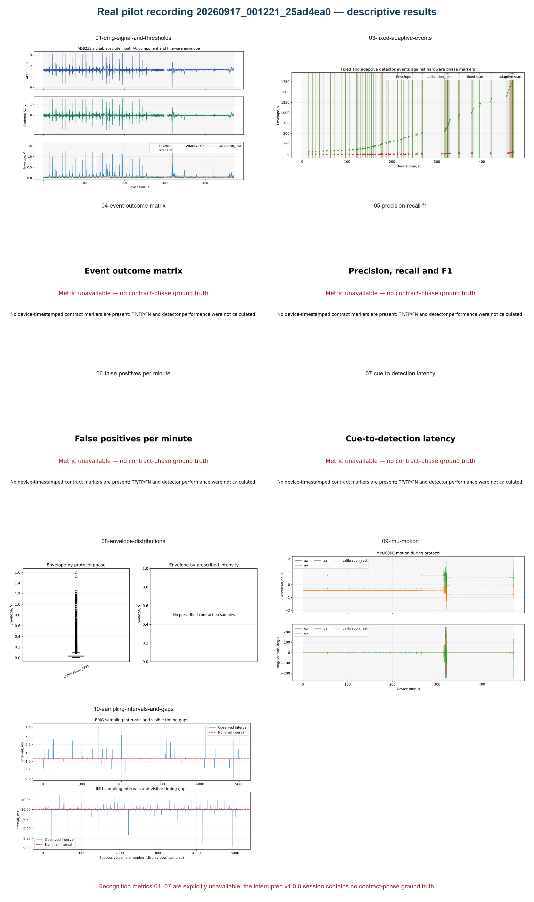

# EMCS Research Platform v1.0.1

EMCS Research Platform is an open research implementation of an
electromyographic control-system acquisition and evaluation pipeline based on
ESP32-S3. It combines a high-rate ADS1115/AD8232 signal path, MPU6050 motion
measurement, embedded fixed and adaptive contraction detectors, a Windows
desktop application and reproducible offline analysis.

The platform is intended for algorithm development and controlled laboratory
experiments. It is not a clinical instrument, does not provide diagnostic
measurements and does not currently implement a production assistive-device
actuator or USB/Bluetooth HID output.

> **Safety warning:** this is a research prototype, not a medical device.
> When electrodes are attached to a person, use an autonomous,
> appropriately isolated battery-powered setup. Do not connect a participant
> to a mains-powered experimental system.

## Hardware architecture

The reference build uses an ESP32-S3 N16R8. AD8232 OUT is sampled by ADS1115
AIN0 relative to ground. The ADS1115 and MPU6050 share the 100 kHz I2C bus.
AD8232 lead-off outputs are read independently and override the contraction
detectors.

| Device signal | ESP32-S3 or peripheral connection | Configuration |
|---|---|---|
| ADS1115 SDA | GPIO8 | I2C address 0x48 |
| ADS1115 SCL | GPIO9 | 100 kHz |
| ADS1115 AIN0 | AD8232 OUT | AIN0–GND, ±4.096 V, continuous 860 SPS |
| AD8232 LO− | GPIO4 | Digital input |
| AD8232 LO+ | GPIO5 | Digital input |
| MPU6050 SDA | GPIO8 | I2C address 0x68 |
| MPU6050 SCL | GPIO9 | 100 Hz output, ±2 g, ±250 deg/s |
| All grounds | Common GND | 3.3 V-compatible logic |

Detailed wiring notes are in docs/hardware.md.
Desktop operation and safety controls are described in
[docs/desktop-application.md](docs/desktop-application.md).

## Project media

All media below comes from the working project and is stored in
[`docs/images/`](docs/images/). Click a still image to open its full-resolution
version.

### Physical prototype

  

  

### Architecture, wiring and electrode placement

  
  

  
  

### Desktop application

  

  
  

### Real pilot-session results

  

The underlying reviewed export is available at
[`data/examples/20260917_001221_25ad4ea0/`](data/examples/20260917_001221_25ad4ea0/).
It contains the complete losslessly compressed sample CSV, a browser-readable
preview, events, metadata, integrity hashes, HTML report and PNG/SVG figures.
This real v1.0.0 recording was interrupted before contract phase markers were
stored, so it is **not** recognition-validation evidence. Metric figures 04–07
explicitly state that ground truth is unavailable instead of showing invented
performance values.

## Firmware build and execution

ESP-IDF 6.0 or a compatible release is required.

    cd C:\dev\emsu-researching
    idf.py set-target esp32s3
    idf.py build
    idf.py -p COM13 flash
    idf.py -p COM13 monitor

At startup the firmware scans addresses 0x08–0x77, verifies 0x48 and 0x68,
checks MPU6050 WHO_AM_I, configures both devices and performs a stationary
two-second gyroscope-bias calibration. It does not reboot repeatedly after an
I2C failure. Runtime errors are reported and acquisition retries continue.

The binary stream is disabled at boot. The desktop application starts it after
connection. Protocol commands and frame layouts are documented in
docs/protocol.md.

## Desktop application

On Windows:

    install_ui.bat
    run_ui.bat

The PySide6 interface defaults to COM13. Serial I/O and CRC validation run in a
dedicated thread. The application has seven tabs: Dashboard, Experiment,
Signals, 3D Orientation, Computer Control, Results and Diagnostics/Settings.
Persistent indicators expose ESP, ADS1115, MPU6050, electrode, calibration,
CRC and sequence-gap state on every tab.

    python -m desktop_app

Signals provide linked, zoomable and pannable time axes; 5/10/30/60-second
windows; pause-display without pausing recording; crosshair values; curve
visibility; phase/event overlays; expansion; and PNG/SVG/CSV export. Absolute
AD8232 input and its centered AC diagnostic are never presented as the same
quantity. Charts are presented as a scrollable stack with a readable minimum
height. Compact F↑/A↑ event labels identify fixed/adaptive starts; release
lines remain available without overlapping text. Display downsampling does not
alter saved samples.

Each experiment creates a unique directory under `data/recordings/` containing
`samples.csv`, `events.csv`, `metadata.json`, `metrics.json`, `report.html` and
`figures/`. Local recordings are excluded from Git. `samples.csv` preserves
every received native-rate EMG and IMU sample; `events.csv` separately stores
detector events and device-timestamped phase markers. Metadata uses only an
anonymous participant code—never enter a person's name.

## Recognition algorithm

ADS1115 operates continuously at its 860 SPS setting. A microsecond timer
requests samples at a nominal 1163 us period. Because ADS1115 and MPU6050 share
a 100 kHz bus, the actual recoverable ADS rate must be measured for each build;
timer gaps and sample indices explicitly expose missed acquisition slots.
MPU6050 is configured for 100 Hz and its gyroscope bias is estimated from 200
stationary samples.

The 3D Orientation tab also offers a guided stationary calibration: level,
left side, right side, nose down, nose up, upside down and a final level
reference. It estimates residual gyro bias plus per-axis accelerometer offset
and scale. This improves roll/pitch and the 3D view; yaw remains relative
because MPU6050 has no magnetometer.

The embedded EMG path performs:

1. Slow DC baseline removal.
2. Full-wave magnitude through the squared signal.
3. A 43-sample RMS envelope, approximately 50 ms.
4. Ten seconds of quiet calibration.
5. Robust noise estimation: sigma = 1.4826 × MAD.
6. Ton = median + 6 × sigma and Toff = median + 3 × sigma by default.
7. 50 ms contraction confirmation, 100 ms release confirmation and 350 ms
   refractory interval.

The finite states are LEADS_OFF, CALIBRATING, REST, CANDIDATE, ACTIVE and
REFRACTORY. Lead-off immediately blocks detection and contraction events. The
fixed detector retains calibration thresholds. The adaptive detector uses a
rolling rest-only baseline and slowly approaches new robust thresholds.
Adaptation is frozen during contractions, lead-off and strong movement.

## Experiment protocol

The configurable protocol waits for the firmware's actual
`EMG_CALIBRATION_DONE` event before trials can start. Every trial has prepare,
contract-cue and rest phases. Prescribed weak/medium/strong instructions are
balanced and shuffled reproducibly from a recorded seed; they are not measured
force. Sessions support pause and explicit terminal outcomes: `completed`,
`aborted_by_user`, `lead_off` and `hardware_error`. See docs/experiment.md.

Successful algorithm validation requires connected electrodes, both lead-off
inputs low and a labelled human-subject recording collected under an approved
protocol. A hardware-only or lead-off capture must not be reported as
recognition validation.

## Reproducible analysis

Capture without the GUI:

    python analysis/capture_session.py --port COM13 --duration 60

Analyze a v2 session directory (legacy CSV remains supported):

    python analysis/analyze_session.py data/recordings/<session-id>

The analysis creates a local HTML report, JSON metrics and publication-oriented
300 dpi PNG plus SVG figures. For hardware-marker-labelled experiments it
reports per-detector TP, FP, FN, precision, recall, F1, false positives per
minute of negative protocol phases, cue-to-detection latency, per-trial values
and trial-bootstrap 95% confidence intervals. Unlabelled data produce
descriptive plots only; the software does not fabricate performance metrics.
The measured bring-up and 60-second integrity check are documented in
[docs/verification.md](docs/verification.md).

A complete reviewed real pilot export is published in
[`data/examples/20260917_001221_25ad4ea0/`](data/examples/20260917_001221_25ad4ea0/).
See its README before interpreting the figures: the session is useful for raw
signal and sampling inspection but lacks contract-phase ground truth.

## Repository structure

| Path | Purpose |
|---|---|
| main/ | ESP-IDF firmware |
| desktop_app/ | PySide6 acquisition and experiment GUI |
| analysis/ | Capture, integrity checking and scientific analysis |
| tests/ | Protocol, scheduler, synchronization, metric, setting and mapping tests |
| docs/ | Hardware, protocol and experiment documentation |
| docs/images/ | Reviewed project photographs, diagrams, GUI captures and result figures |
| data/ | Data policy, ignored local recordings and reviewed anonymous examples |
| figures/ | Figure policy; generated results are ignored |

## Limitations

- ADS1115 has no sample FIFO; shared-bus scheduling can reduce the recoverable
  rate below its configured 860 SPS.
- Thresholds and motion criteria require validation for each electrode
  placement and population.
- Lead-off signals indicate connection state but do not quantify contact
  impedance.
- MPU6050 yaw is relative and drifts because the sensor has no magnetometer.
- Windows Computer Control is disabled by default. It is mutually exclusive
  with research recording and turns off on F12, disconnect, lead-off,
  calibration/hardware failure or a data age above 300 ms.
- No medical or safety-critical claim is made.

## Citation

A peer-reviewed citation and DOI are not yet available. For the future article:

> Felix Bembiev et al. “EMCS Research Platform.” Journal, year.
> DOI: to be assigned.

Until then, cite the repository URL and the exact Git commit used in the
experiment.

## License

MIT License. Copyright (c) 2026 Felix Bembiev.
